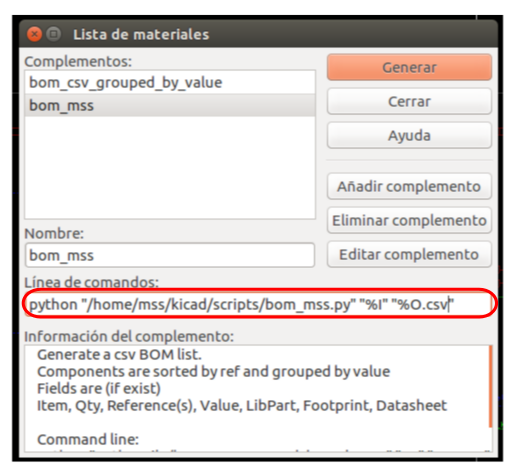

# BOM_kicad
crea bom para la empresa bittele.

## Concepto
Constiste en crea un BOM organizado de la siguiente manera:

#### Item | Reference(s) | Description | Qty Manufacturer | Mfg Part # | Package | Type | Value 

para esto en las __propiedades del simbolo__ se debe agregar un campo que por defecto es __Campo 4__. Pueden dejarlo con ese nombre, en ese campo es donde se colocará el numero de parte del componente, por ejemplo: __PDQ30-Q24-S5-D__.

Una vez se hallan colocado el numero de parte de todos los componentes se procede a generar el BOM.

## USO
Command line:
    
    python "pathToFile/bom_csv_grouped_by_value.py" "%I" "%O.csv"

